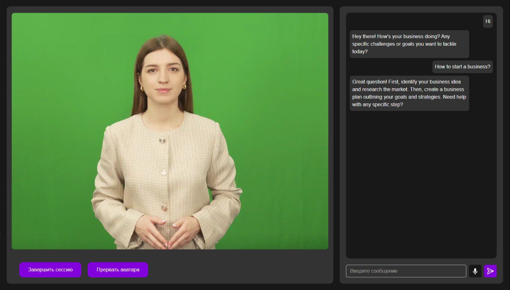

# Interactive Avatar

**Interactive Avatar** is a simple Next.js application that allows real-time interaction with an AI-powered avatar via chat or speech. The avatar is rendered and streamed using the [HeyGen API](https://www.heygen.com/), offering a responsive and engaging user experience.



## Features

- 🎤 **Real-time Voice Interaction** — Talk to the avatar and receive spoken responses.
- 💬 **Chat-Based Communication** — Type messages and get replies in a chat interface.
- 👤 **Streaming Avatar** — Uses HeyGen’s streaming avatar service.
- 🚀 **Docker Support** — Easy to run using Docker Compose.

## Getting Started

### Prerequisites

- Node.js (v18+ recommended)
- Docker & Docker Compose (optional, for containerized deployment)
- A valid [HeyGen API key](https://www.heygen.com/)

### Installation

1. **Clone the repository:**

    ```bash
    git clone https://github.com/laviprog/interactive-avatar.git
    cd interactive-avatar
    ```

2. **Set up environment variables:**

    Create .env.local or .env.production file based on the provided .env.example:
    
    ```bash
    cp .env.example .env.local
    ```
    Then fill in the required variable:
    
    ```
    NEXT_PUBLIC_HEYGEN_API_KEY=your-api-key
    ```
    Other variables in .env.example are optional and can be configured as needed.

3. Install dependencies:

    Choose your preferred package manager:
    
    ```bash
    npm install
    # or
    yarn
    # or
    pnpm install
    ```
4. Run the app locally:
    ```bash
    npm run dev
    # or
    yarn dev
    # or
    pnpm dev
    ```
Open http://localhost:3000 to view it in the browser.


## Running with Docker
To launch the app in a Docker container:

```bash
docker compose up --build -d
```
Make sure to update the environment variables in the .env file or configure them through Docker.
